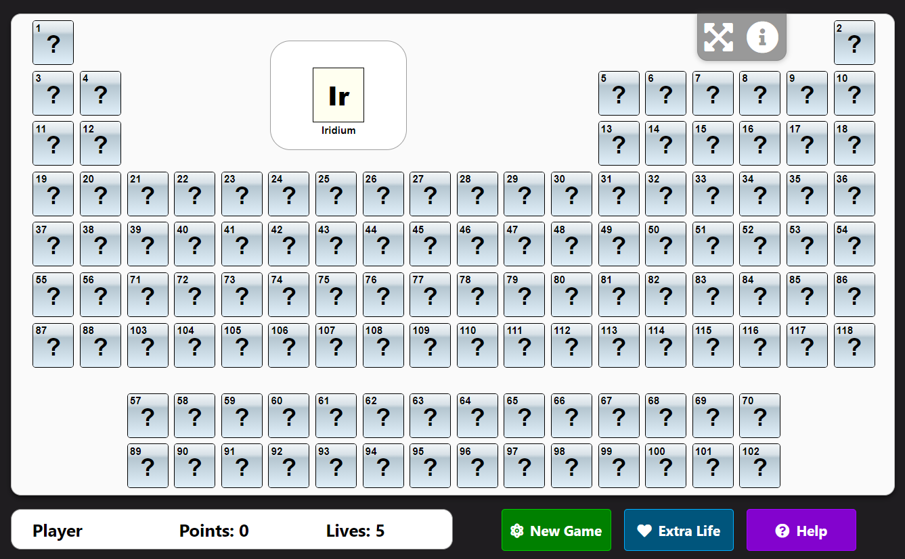
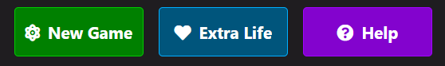

# Periodic table quiz

The periodic table quiz is a game designed to help students and academics learn and improve there knowledge and ordering of the Periodic table.

This game was designed to demonstrate how pure JavaScript works in a real-world context. The site will be targeted toward people who love to implement more advanced JavaScript concepts but also Chemsitry, puzzles and memory games. This game is a fully responsive JavaScript quiz that allows the user to put there knowledge and memory to the test and reassemble the Periodic Table.

- The user begins with 5 lives and will be given one element at a time
- The user is then tasked with clicking the correct place to which that element belongs in the table. 
- If correct the user will be rewarded with a point but if incorrect the user will lose a life.
- The order of the elements a user will recieve is random and therefore different for every game and user.
- The user has the ability to purchase more lives but at a cost of 2 points per life.
- Once the the user has completed the table they will be informed of there final score.
- Maximum score total with no extra lives needed is equal to 118.

## Features 

### Existing Features

- __The Game Area__
  - This section is the game and contains all elements the user needs to play. The user is able to see the periodic table, scores, lives, toolbar and buttons.

- __The Periodic Table__ 
  - Featured at the top of the page, the Love Maths logo and heading is easy to see for the user. Upon viewing the page, the user will be able to see the name of the game.

- __The New Element Area__
  - This area displays the current element tile, chemical symbol and the name of that element. The user must guess where they think this element belongs in the table
  - Once guessed correctly, a new element will be loaded into the tile.

- __The Toolbar__
  - This toolbar is located in the top right of the game.
  - The two buttons allow the user to enter full screen mode and access 'about' information through an alert.

- __The Score Area__

  - This section will allow the user to see exactly how many points and lives they have. 

__The Buttons__

  - This section contains 3 buttons.
  - New Game - Allows the user to start a new game. On click an new game alert is displayed. 
  - Extra Life - Allows the user to 'purchase' an extra life. On click Add Lives alert is displayed. 
  - Help - Allows the user to read the rules of the game. On click help alert is displayed.

- __The Alert Box__

  - About alert - Displayed on click of question mark icon in toolbar. Contains about information for game.

  - Help Alert - Contains rules of the game.

  - Add lives Alert - Confirmation message of extra life.

  - Error Lives Alert - Error if the user does not have enough points to 'purchase' an extra life.

For some/all of your features, you may choose to reference the specific project files that implement them.

In addition, you may also use this section to discuss plans for additional features to be implemented in the future:

- __The New Game Alert__

  - Start a new game by requiring the user to enter there name.

- __The 'Content does not fit'Alert__

  - If a users device width is too small (< 640px) an alert is displayed. This alert requires the user to enter landscape mode to access game.

### Features Left to Implement

- __Variable Quiz Length__
    - This feature would allow the use to select how many tiles in the periodic table are already solved.

- __Animation__
    - Add animations that move the main tile to the position it belongs to in the table upon correct answer.

## Testing 
- I tested this game works in different browsers: Chrome, Firefox, Edge.
- I confirmed that the game results are always correct.
- I confirmed that the project is responsive, looks good and functions on all standard screen sizes using the devtools device toolbar.
- I confirmed the name entry input works; requires an entry into the field, accepts only characters (Desktop). Start button works and user name is added to the DOM.
- I confirmed the colours and fonts chosen are easy to read and accessible by running it through lighthouse in devtools.

- I confirmed that the table, buttons, element tiles, alerts, information text and score area are all readable and easy to understand.

### Validator Testing 

- HTML
    - No errors were returned when passing through the official [W3C validator](https://validator.w3.org/nu/?doc=https%3A%2F%2Fcode-institute-org.github.io%2Flove-maths%2F)
- CSS
    - No errors were found when passing through the official [(Jigsaw) validator](https://jigsaw.w3.org/css-validator/validator?uri=https%3A%2F%2Fvalidator.w3.org%2Fnu%2F%3Fdoc%3Dhttps%253A%252F%252Fcode-institute-org.github.io%252Flove-maths%252F&profile=css3svg&usermedium=all&warning=1&vextwarning=&lang=en)
- JavaScript
    - No errors were found when passing through the official [Jshint validator](https://jshint.com/)
      - The following metrics were returned: 
      - There are 11 functions in this file.
      - Function with the largest signature takes 2 arguments, while the median is 0.
      - Largest function has 10 statements in it, while the median is 3.
      - The most complex function has a cyclomatic complexity value of 4 while the median is 2.

### Unfixed Bugs

No unfixed Bugs.

## Deployment

This section should describe the process you went through to deploy the project to a hosting platform (e.g. GitHub) 

- The site was deployed to GitHub pages. The steps to deploy are as follows: 
  - In the GitHub repository, navigate to the Settings tab 
  - From the source section drop-down menu, select the Master Branch
  - Once the master branch has been selected, the page will be automatically refreshed with a detailed ribbon display to indicate the successful deployment. 

The live link can be found here - https://dybacz.github.io/periodic-table-quiz/

## Credits 

### Content 

- The icons used in the buttons and the toolbar were taken from [Font Awesome](https://fontawesome.com/)

### Media

- The image used for the favicon and username input textbox are from [Icons-icons](https://icon-icons.com/icon/atom-sciencie-scientific/53030).
- The image used for the 'This content does not fit' alert are from [Iconefinder](https://www.iconfinder.com/icons/326583/orientation_rotation_screen_icon)